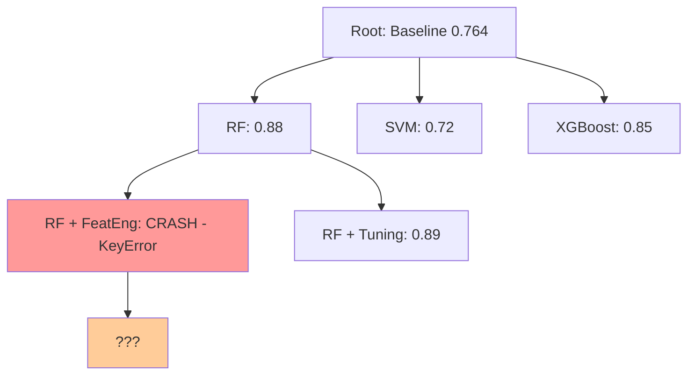
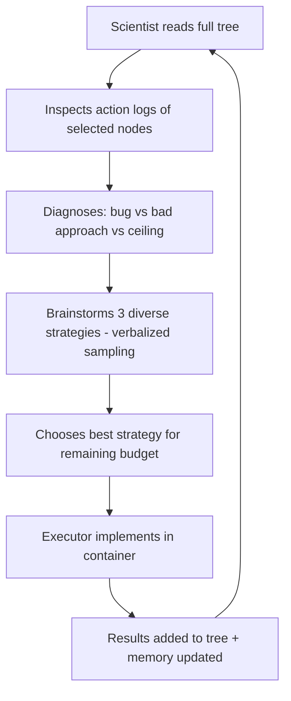
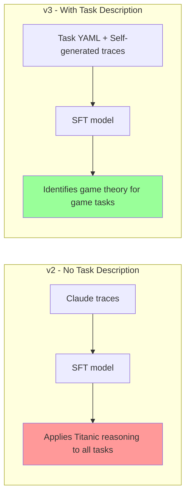
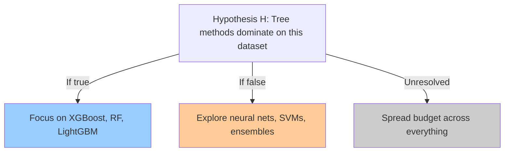

# MLScientist
## Training an LLM to Guide ML Experiment Design

**Hypothesis-Driven Search with Value of Information Rewards**

March 2026

---

# Problem: Automating ML Experiment Design

A human ML researcher spends most of their time **deciding what to try next**, not writing code.

- Read results from the last experiment
- Diagnose why it worked or failed
- Decide whether to refine, pivot, or explore something new
- Allocate limited compute budget wisely

**Goal**: Train a "scientist" LLM that makes these decisions, reducing wasted compute and finding better solutions faster.

**Benchmark**: MLGym -- 9 diverse ML tasks (classification, regression, game theory, RL)

---

# Architecture: Scientist + Executor + Container


| Role | What it does | Model |
|------|-------------|-------|
| **Scientist** | Reads tree, diagnoses failures, proposes next experiment | Qwen3-4B / GPT-4o / Claude |
| **Executor** | Writes and runs code to implement the scientist's direction | Qwen3-4B |
| **Container** | Isolated Docker env for execution, validation, scoring | MLGym |

The scientist proposes **what** to try. The executor decides **how** to implement it.

---

# Current Approach: MCTS for ML Experiments



**MCTS sees**: Node D scored 0 (crash). Reduce branch value.

**A human scientist sees**: The crash was a KeyError in column naming -- a fixable bug. Feature engineering is still worth exploring.

**This is the Duhem-Quine problem**: When an experiment fails, you do not know whether the *hypothesis* was wrong or the *implementation* was wrong.

---

# Why MCTS Fails for ML Experiments

**Problem 1: Value estimation is intractable**
- Chess: value = win probability (well-defined)
- ML experiments: value = "how promising is this direction?" (depends on full problem structure)

**Problem 2: Cannot reason about failure modes**
- UCB sees scores. It cannot distinguish:
  - Bad approach (linear model on nonlinear data)
  - Fixable bug (KeyError in feature engineering code)
  - Near-ceiling (RF at 0.90 with little room to improve)

**Problem 3: Executor independence**
- In Adaptive MCTS, the executor **ignores** the proposed strategy ~40% of the time
- Does simple config changes that happen to work
- The tree structure becomes meaningless

**Evidence**: Nodes attempting PyTorch: ~70% crash rate. Nodes attempting sklearn: ~10% crash rate. MCTS cannot learn this.

---

# Our Approach: LLM-Guided Tree Search



**Key advantages over MCTS:**
1. Reasons about **why** experiments fail (not just that they failed)
2. Builds on success: "log transform helped GrLivArea -- try other skewed features"
3. Counterfactual reasoning: "target encoding instead of one-hot might avoid cardinality explosion"
4. Budget-aware: "5+ nodes left -- explore. 2 or fewer -- refine best approach"

---

# Results: LLM-Guided vs Baselines

**Battle of Sexes (game theory)**

| Method | n5 mean | n15 mean |
|--------|---------|----------|
| Softmax | 1.27 | 1.40 |
| AIRA MCTS | 1.30 | 1.38 |
| Open-Ended | 1.29 | 1.39 |
| LLM-Guided v1 | 1.21 | 1.20 |
| **LLM-Guided v2.1** | **1.26** | **1.42** |

**Mountaincar (RL, n5)**

| Method | Mean Best | Std |
|--------|----------|-----|
| **Adaptive MCTS** | **65.39** | 7.84 |
| LLM-Guided v6 | 61.70 | 9.62 |
| AIRA Vanilla | 56.82 | 11.12 |

LLM-Guided is best on structured tasks. RL remains challenging (executor bottleneck).

---

# N20 Scaling Results

**Performance scales strongly with budget (n5 to n20):**

| Task | Method | n5 | n20 | Delta |
|------|--------|-----|------|-------|
| Titanic | baseline | 0.827 | **0.945** | +0.118 |
| Regression | sq_e1 (SFT) | 0.885 | **0.909** | +0.024 |
| BoS | sq_battle_e3 (SFT) | 1.371 | **~1.433** | +0.062 |
| BoS | baseline | -- | 1.441 | -- |

**Key finding**: Both SFT and baseline improve substantially at n20. Titanic baseline jumps from 0.827 to 0.945 -- a massive gain from search budget alone.

**Open question**: Does the SFT advantage widen or narrow with more budget? Data collection ongoing.

---

# Task Ceiling Analysis

| Task | Baseline | Our Best | Ceiling | Headroom |
|------|----------|----------|---------|----------|
| Battle of Sexes | 1.02 | 1.44 | ~1.5-1.6 | ~10% |
| Regression | 0.88 | 0.92 | ~0.93 | **~1%** |
| Titanic | 0.77 | 0.945 | ~0.88-0.90 | **near/past ceiling** |
| Prisoner's Dilemma | 2.37 | 2.39 | ~2.5 | ~5% |
| Mountain Car | 33.8 | 68.9 | ~90+ | **~25%** |

**Where to focus:**
- Regression is solved (1% headroom)
- Titanic has exceeded our ceiling estimate at n20
- **Mountain Car has the most room for improvement** -- priority target for RL pipeline
- Battle of Sexes approaching ceiling but still ~10% headroom

---

# Qualitative Success: Regression Task

**Scientist reasoning on House Price (R^2)**:

> "GrLivArea shows high positive skewness (1.27). Log transform will reduce the influence of outliers and make the relationship with SalePrice more linear. This should improve tree-based models that split on this feature."

**Iterative improvement**:
1. Log transform on GrLivArea --> R^2: 0.888 (+0.006)
2. Extend to LotArea, TotalBsmtSF --> R^2: 0.894 (+0.012)
3. Combine with gradient boosting tuning --> R^2: 0.898 (+0.016)

The scientist **built on prior results**, identifying a pattern and generalizing it.

**Battle of Sexes**: Scientist identified "opponent copies with 80% probability" --> designed adaptive exploitation strategy --> 1.44 payoff (vs 1.24 baseline).

---

# Qualitative Failure: Hallucinating Titanic on Game Theory

**Prisoner's Dilemma (out-of-domain task)**:

> "We should analyze the survival rate by Pclass and create interaction features between Sex and Embarked..."

The SFT scientist applied Titanic-specific reasoning to a game theory problem. It memorized task-specific patterns rather than learning general scientific reasoning.

**Root cause**: Training data (v2) used Claude-generated traces without task descriptions. The model learned "what good reasoning looks like" but not "what this specific task requires."

**Fix in v3**: Include MLGym YAML task description in every training sample. Model correctly identifies game theory concepts for game tasks.

---

# Training v1: Template-Based Counterfactual QA

**Data**: 8,170 QA pairs from tree search outputs (template-generated)

**SFT Results**:
- Loss: 2.16 --> 0.07 (massive offline improvement)
- Perplexity: 36 --> 1.1
- **Downstream: zero improvement on actual tasks**

**GRPO v1**: All completions got same reward --> zero gradient --> no learning

**GRPO v2**: Had signal (reward_std ~0.4) but flat reward curve

**Lesson**: Offline metrics (loss, perplexity) do not predict downstream performance. Template-generated data teaches format, not reasoning.

---

# Training v2: Claude-Generated Reasoning

**Data**: 704 traces from Claude Haiku (~$4.37)
- Rich reasoning with counterfactual analysis
- Literature references, diagnostic patterns

**SFT v2 Results** (2-GPU eval, scientist != executor):

| Model | House Price R^2 | Delta | p-value |
|-------|----------------|-------|---------|
| SFT | 0.890 | +0.009 | 0.10 |
| DPO | 0.885 | +0.004 | -- |
| Baseline | 0.881 | -- | -- |

**Full 9-task eval**: Nothing statistically significant.

**Problem**: Model ignored task descriptions. Applied Titanic reasoning to game theory.

---

# Training v3: Grounded Self-Generated Data

**Key innovation**: Task descriptions from MLGym YAML configs in every sample.

**Two formats**: Focused QA (2,378 samples) + Deep think traces (788 samples)

**Statistically significant results**:

| Model | Task | Score | Baseline | Delta | p-value |
|-------|------|-------|----------|-------|---------|
| sq_e1 | Titanic | 0.873 | 0.827 | **+0.046** | **0.032** |
| dt_titani_e6 | Titanic | 0.858 | 0.827 | **+0.031** | **0.003** |

First significant improvements in the project.

---

# Key Finding: Task Grounding Matters



Without task description: "survival rate by Pclass" on Prisoner's Dilemma

With task description: "opponent copies with 80% probability" on Battle of Sexes

**Task grounding is not optional** -- it is the difference between memorization and reasoning.

---

# Key Finding: Per-Task > Multi-Task

| Training Strategy | Avg Delta | Best Result |
|-------------------|-----------|-------------|
| **Per-task small_ques** | **+0.016** | +0.046 on Titanic |
| Per-task deep_think | +0.008 | +0.031 on Titanic |
| Multi-task (all) | -0.018 | -0.003 (best case) |
| Multi-task + deep_think | -0.028 | -0.008 (best case) |

**Multi-task training consistently hurts.** The model loses task-specific reasoning when trained on mixed data.

Additional findings:
- **Early epochs > later epochs** (overfitting to training data format)
- **Regression is near-ceiling** (all models within +/-0.003 of baseline)
- The search process already finds near-optimal solutions; the scientist helps most on tasks with large search spaces

---

# Why RL: Limitations of SFT

SFT teaches **what** to reason about, but not **how to allocate experimental budget**.

Given 12 nodes, the SFT scientist does not know:
- Which hypotheses are worth testing first?
- When to stop validating and move on?
- How to balance exploration vs exploitation?
- When further testing is wasteful?

These are **decision-theoretic questions** that require optimizing a policy, not imitating demonstrations.

We need a reward signal that captures: **"Did this experiment teach the scientist something useful about the problem?"**

---

# Value of Information (VoI)

**A hypothesis is valuable if resolving it changes what experiments the scientist runs next.**



**VoI(H) = KL( P_resolved || P_unresolved )**

High VoI = resolving H would significantly shift experimental strategy
Low VoI = scientist would run the same experiments regardless

**Two types of valuable hypotheses:**
- **Score-improving**: "Tree methods dominate" --> focus on tree methods
- **Space-pruning**: "RNNs won't work here" --> eliminate entire model class, save budget

---

# VoI: Worked Example

**Titanic, Node 1 -- explore:**

```
H1: "FamilySize = SibSp + Parch + 1 is a useful latent variable"

P_unresolved: {feat_eng: 0.35, tree: 0.30, preprocess: 0.20, nn: 0.15}
P_H1_true:    {feat_eng: 0.55, tree: 0.25, preprocess: 0.15, nn: 0.05}
P_H1_false:   {feat_eng: 0.20, tree: 0.35, preprocess: 0.25, nn: 0.20}

logit P(H1=true) = 0.52  (thought.md empty, roughly uncertain)
P_resolved = 0.52 * P_H1_true + 0.48 * P_H1_false

VoI(H1) = KL(P_resolved || P_unresolved) = 0.18  [reasonably high]
```

**Prediction**: XGBoost + FamilySize will score > baseline by 0.02-0.04
**Result**: 0.793 vs 0.764 -- improvement of 0.029. Prediction correct.
**R1** = 1.0 / (0.04 - 0.02) = 50 [sharp correct prediction]
**R2** = 0.18 [VoI of the hypothesis]

---

# Reward Structure: R1 + R2 + R3

| Component | What It Measures | Applied |
|-----------|-----------------|---------|
| **R1 -- Resolution** | Did the experiment move confidence in its hypothesis? Sharpness-weighted prediction accuracy. | Per node |
| **R2 -- Information** | Did this explore node introduce a valuable hypothesis? Measured by VoI. | Explore nodes only |
| **R3 -- Performance** | Did the tree find a good solution? Best normalized score. | End of tree |

```
R_node  = 0.4 * R1 + 0.3 * R2    # dense, per-node signal
R_final = 0.3 * R3                 # sparse, end-of-tree signal
```

**Recent VoI reward fixes:**
- **Validation**: separates "hypothesis is false" from "prediction was wrong" -- checks directional improvement, not interval
- **Early rejection**: 2 consecutive validate failures --> hypothesis REJECTED (saves budget)
- **Challenge logic**: hypothesis survives if approach still improves over baseline

**W&B integration**: loss, rewards, exploration signals, node type distributions, per-task curves (project: voi-scientist-rl)

---

# Next Steps

1. **Complete n20 evaluation**
   - Finish data collection across all tasks and methods
   - Determine if SFT advantage widens or narrows with budget

2. **GRPO training with updated VoI rewards**
   - Leverage improved validation/rejection logic
   - Monitor via W&B dashboards (voi-scientist-rl)

3. **RL task pipeline** (highest priority)
   - Build RL-specific Apptainer container (mlgym_rl.sif)
   - Mountain Car: ~25% headroom -- most room for improvement
   - Full comparison: LLM-guided (n5/n20) + SFT + VoI RL + AIRA

4. **Evaluation & ablation**
   - Held-out MLGym tasks (generalization)
   - Ablation: contribution of each reward component
   - Calibration study for logit-based belief estimates

5. **Scale up**
   - Larger scientist models (8B, 14B)
   - Transfer to non-MLGym benchmarks

---

# Summary

| What | Finding |
|------|---------|
| **Architecture** | Scientist + Executor decomposition outperforms single-model MCTS |
| **Selection** | LLM scientist > formula-based (UCB/softmax) on structured tasks |
| **Training data** | Task-grounded data >> Claude traces >> templates |
| **Training scope** | Per-task >> multi-task (multi-task consistently hurts) |
| **Best results** | +0.046 accuracy on Titanic (p=0.032), +0.031 (p=0.003) |
| **N20 scaling** | Strong gains with budget: Titanic 0.827->0.945, BoS 1.371->1.433 |
| **Task ceilings** | Regression near-solved (~1%), Mountain Car has most headroom (~25%) |
| **Key insight** | SFT teaches *what* to reason about; RL needed to teach *how to allocate budget* |
| **Next phase** | VoI-guided GRPO with improved rewards + RL task pipeline |

**The central goal**: A scientist that finds better solutions faster, with fewer wasted experiments, by genuinely learning the structure of each problem rather than performing shallow local optimization.
